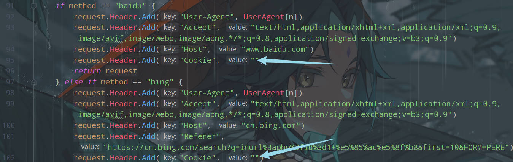
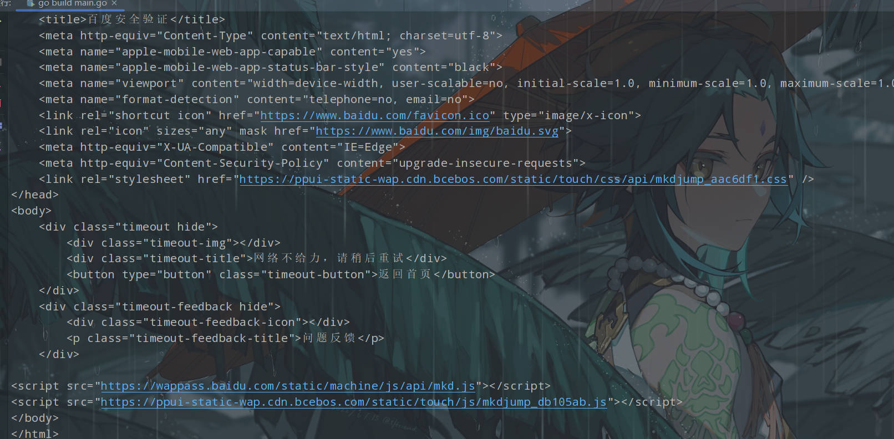
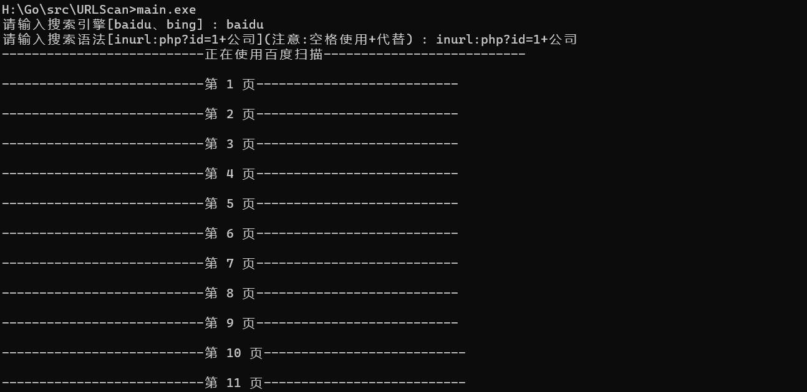

安装第三方库

```
go get github.com/axgle/mahonia
go install github.com/axgle/mahonia
go get golang.org/x/text/  
go install golang.org/x/text/
go get github.com/PuerkitoBio/goquery 
go install github.com/PuerkitoBio/goquery
```

修改配置

1. 添加Cookie（在config/config.go中添加）



不然运行多次后会出现百度安全验证



2. 配置忽略的站点(在config/config.go中添加)


运行结果


